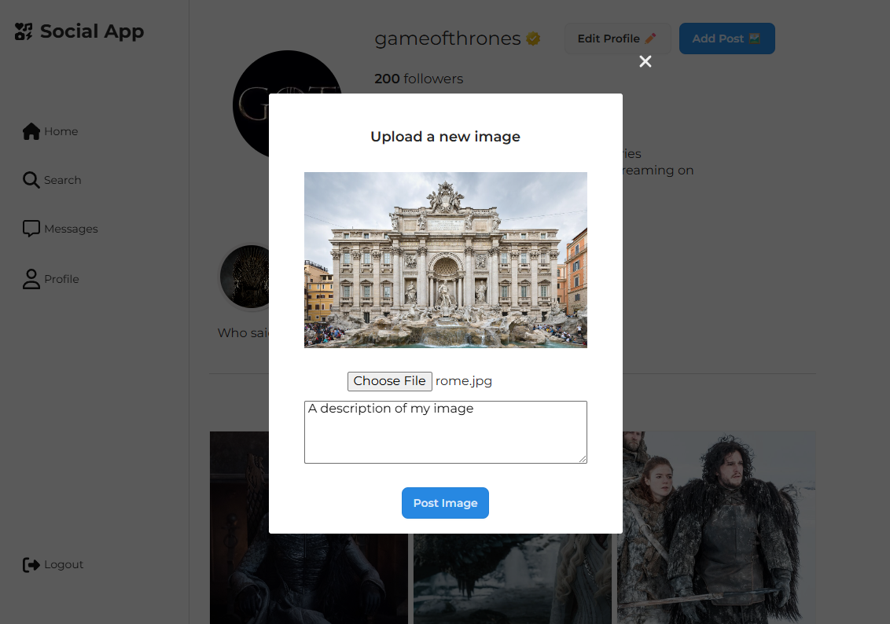
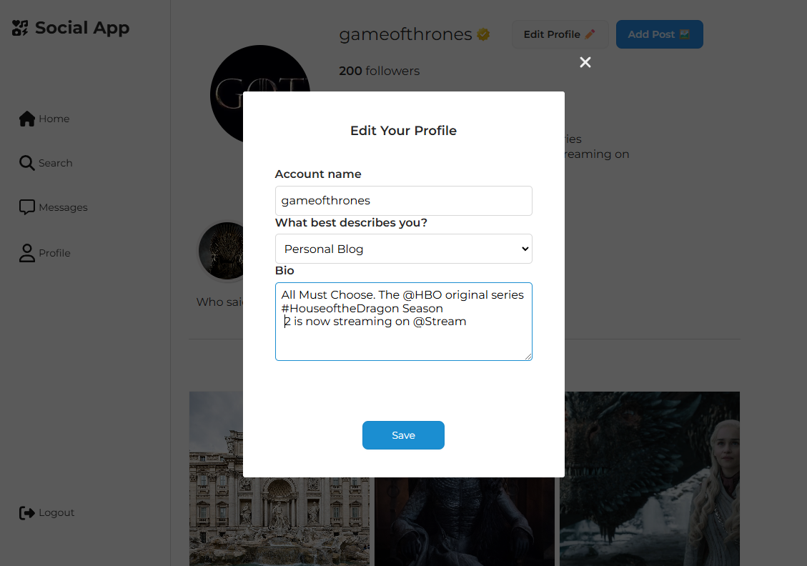

# **SOCIAL APP** 🚧 *In Progress*

**View Live Site**
https://jennyglover.github.io/social-app/

This **Social App** is a modular, scalable application designed with a structured JavaScript architecture. Key features include:

- **API Integration**: `Api.js` handles backend communication for user and content data.
- **Dynamic UI Components**: Modular components like `Card.js`, `Popup.js`, and `Section.js` power interactive features such as user profiles, posts, and popups.
- **Form Validation**: `FormValidator.js` ensures seamless and secure data input.
- **Image and Form Popups**: Specialized popups (`PopupWithForm.js`, `PopupWithImage.js`) enhance user engagement.
- **User Management**: `UserInfo.js` manages profiles and settings.

### Build and Optimization
Built with Webpack, Babel, PostCSS, and Prettier, the app offers modern features, optimized performance, and consistent code styling.
